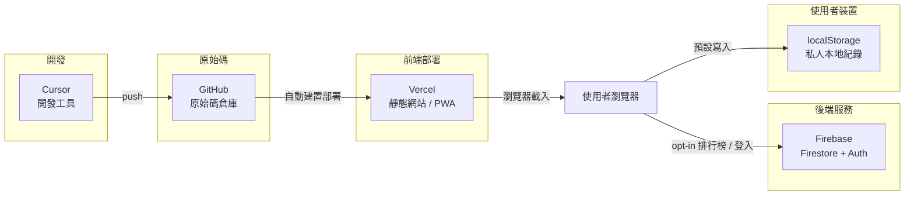

# diy-daily-record 架構說明

本文件說明專案的角色分工、資料流向與部署方式。**網站前端只部署在 Vercel**；Firebase 僅提供後端服務（Firestore、Authentication），不作網站 Hosting。

## 系統總覽



## 各元件職責

| 元件 | 角色 | 說明 |
|------|------|------|
| **Cursor** | 開發工具 | 在本機編輯程式、執行 `npm run dev` / `npm run build` |
| **GitHub** | 原始碼倉庫 | 版本控制；推送到 `main` 後觸發 Vercel 自動部署 |
| **Vercel** | **前端部署（唯一）** | 建置 `dist/` 並提供正式網址、PWA、靜態資源 |
| **Firebase** | 後端服務 | **Firestore**（排行榜聚合 `monthlyLeaderboard`）、**Authentication**（跨裝置同步帳號，進階功能） |
| **localStorage** | 私人本地紀錄 | 預設保存每次紀錄的時間與備註；不上傳至伺服器 |

## 資料流向

### 私人紀錄（預設）

1. 使用者在表單輸入時間、備註（可選）
2. 點擊「記錄這一次」
3. 資料**只寫入**瀏覽器 `localStorage`（key: `wank_records`）
4. 本地統計（距離上次、本月次數、平均間隔、最近 10 筆）皆由前端從 `localStorage` 計算

### 排行榜（opt-in）

1. 使用者勾選「加入本月排行榜」並填寫公開暱稱
2. 新增紀錄時，除本機保存外，向 Firestore **`monthlyLeaderboard`** 寫入或遞增聚合資料
3. 上傳欄位：`displayName`、`month`、`count`、`updatedAt`
4. **不會**上傳具體紀錄時間或備註
5. 排行榜列表由前端查詢 `monthlyLeaderboard` 顯示（不再讀取舊 `records` collection）

### 帳號 / 跨裝置同步（進階）

1. Firebase **Authentication** 處理註冊、登入、登出、忘記密碼
2. 登入狀態顯示於頁面底部「跨裝置同步」區塊
3. 跨裝置同步本機紀錄仍為規劃中功能；**不登入也可完整使用本機紀錄**

## Firestore 集合

| 集合 | 狀態 | 用途 |
|------|------|------|
| `monthlyLeaderboard` | **使用中** | 本月排行榜聚合資料 |
| `records` | 已淘汰 | 舊架構；規則禁止新寫入 |
| `messages` | 已停用 | 留言板已移除 |

安全規則見專案根目錄 `FIRESTORE_RULES_COMPLETE.txt` 與 `FIRESTORE_RULES.md`。

## 部署方式

### 正式環境（唯一）：Vercel

- **推薦**：GitHub 連接 Vercel，推送 `main` 自動部署
- **手動**：`npm run deploy:vercel`（需已安裝並登入 Vercel CLI）

建置設定（`vercel.json` 已包含）：

- Build Command: `npm run build`
- Output Directory: `dist`
- Install Command: `npm install`

### Firebase：不作網站 Hosting

- **不要**執行 `firebase deploy` 部署網站
- `package.json` 已移除可用的 `deploy:firebase` script，避免誤觸
- 根目錄 `firebase.json` 若仍含 `hosting` 區塊，屬歷史遺留設定，**本專案不以 Firebase Hosting 作為正式網址**
- Firebase 後台仍需維護：**Firestore 規則**、**Authentication** 設定、必要時的 **Composite Index**

## 本機開發

```bash
npm install
npm run dev      # http://localhost:3000
npm run build    # 輸出 dist/
npm run preview  # 預覽 dist/
```

## 相關檔案

| 檔案 | 說明 |
|------|------|
| `src/firebase.js` | Firebase SDK 初始化（Firestore、Auth） |
| `src/records.js` | 本機紀錄寫入 |
| `src/leaderboardSync.js` | 排行榜 opt-in 同步至 Firestore |
| `src/leaderboard.js` | 讀取 `monthlyLeaderboard` 顯示排行榜 |
| `src/auth.js` | Firebase Authentication |
| `vercel.json` | Vercel 建置與路由設定 |
| `firebase.json` | 歷史 Hosting 設定（**不使用**）；規則請在 Console 手動貼上 |
